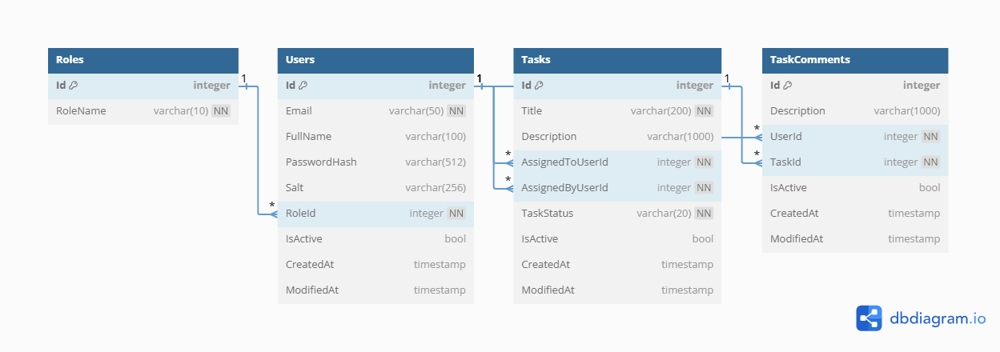

# Task Management API Documentation

## Overview


This project is a **Task Management API** built using **.NET 9**, **ASP.NET Core Web API**, **SQL Server**, **Entity Framework Core (EF Core)**, and hosted on **Azure App Service**. The project follows **Clean Architecture** principles to ensure maintainability and scalability.

**API Hosted URL:**  
[Task Management API](https://taskmanagementapi-gpc2bbb9dffharch.indonesiacentral-01.azurewebsites.net/index.html)

---

## Folder Structure

The folder structure is organized to follow **Clean Architecture** principles, ensuring separation of concerns and scalability. Here's the structure:

### Explanation:

- **TaskManagement.API**: Contains the ASP.NET Core Web API controllers, models, and routes to handle HTTP requests.
- **TaskManagement.Infrastructure**: Contains database access logic, including EF Core migrations, models, and SQL scripts for task operations.
- **TaskManagement.Tests**: Unit testing project using **NLog** for logging, **Moq** for mocking dependencies, and tests for services like **TaskService**.
- **TaskManagement.Core**: Business logic layer containing interfaces, services, and other reusable code.
- **TaskManagement.Domain** Domain layer contains Interfaces, Entities, Enums
- **SQLScripts**: Contains SQL scripts such as `Get_All_Comments_On_Task.sql` and `Get_All_Tasks_Assigned_To_User.sql`.

---

## Running the Project Locally

1. **Clone the Repository**: Clone the repository to your local machine using Git.
    ```bash
    git clone https://github.com/Pavan8374/task-management.git
    ```

2. **Setup the Database**:
   - Make sure SQL Server is installed locally or use a cloud SQL service.
   - Update the **connection string** in `appsettings.json` of the `TaskManagement.API` project to point to your SQL Server instance.

3. **Apply Migrations**:
   - Open the **Package Manager Console** in Visual Studio or use the **CLI** to run EF Core migrations.
   - In the **Package Manager Console**, run:
     ```bash
     Update-Database
     ```

4. **Build and Run**:
   - Open the solution in Visual Studio.
   - Set the `TaskManagement.API` project as the startup project.
   - Press **F5** to run the project locally.

---

## API Endpoints

### **Auth APIs**

1. **POST: `/api/Auth/signUp`**  
   Sign up a new user and generate a JWT token.
   - Request Body: User information (email, password, fullname, isAdmin).
   - Response: JWT Token for authentication.

2. **POST: `/api/Auth/signIn`**  
   Log in with a user and generate a JWT token.
   - Request Body: Credentials (email, password).
   - Response: JWT Token for subsequent API calls.

### **Task APIs**

1. **POST: `/api/Task`**  
   Create a new task and assign it to a specific user.
   - Request Body: Task details (title, description, assigned user).
   - Response: Created task object.

2. **GET: `/api/Task/{Id}`**  
   Retrieve task details by ID.
   - Parameters: Task ID.
   - Response: Task object with details.

3. **GET: `/api/Task/user/{userId}`**  
   Retrieve all tasks assigned to a specific user.
   - Parameters: User ID.
   - Response: List of tasks assigned to the user.

### **Swagger UI**

To test the API, Swagger UI has been integrated. You can access it at:
- **Swagger URL**: [Task Management API Swagger](https://taskmanagementapi-gpc2bbb9dffharch.indonesiacentral-01.azurewebsites.net/index.html)

---

## Database Tables and Migrations

### **Tables Created**:
1. **Users**: Stores user data (name, email, password).
2. **Roles**: Stores predefined roles like **Admin** and **User**.
3. **Tasks**: Stores task details (title, description, assigned user).
4. **TaskComments**: Stores comments on tasks.

The database schema was created using **Entity Framework Core** migrations. You can find the migration files in the **`Migrations`** folder inside the **`TaskManagement.Infrastructure`** project.

### **ER Diagram**:

- **Task Management ER Diagram**:  
    
  [View ER Diagram online](https://dbdiagram.io/d/TaskManagement-ER-Diagram-680de9e61ca52373f583a531)

### **SQL Scripts**:
SQL scripts were created for common queries:
- `Get_All_Comments_On_Task.sql`: Retrieves all comments related to a task.
- `Get_All_Tasks_Assigned_To_User.sql`: Retrieves all tasks assigned to a user.

You can find these SQL scripts in the **SQLScripts** folder in the **TaskManagement.Infrastructure** project.

---

## Code Improvements

As part of the task, I made the following improvements:
- Replaced old synchronous code with asynchronous methods using `async`/`await` and `Task` for better performance.
- Added **try/catch** blocks to catch and handle exceptions gracefully, improving error management.

---

## Azure Deployment (Optional Task)

I deployed the API to **Azure App Services** and created an **Azure SQL Database** to host the application and data. The deployment was done using **GitHub Actions**.

**API Hosted URL:**  
[Task Management API Azure](https://taskmanagementapi-gpc2bbb9dffharch.indonesiacentral-01.azurewebsites.net/index.html)
 

---

## Unit Testing

A unit testing project called **TaskManagement.Tests** has been created to test the application.

- **Testing Framework**: **NUnit** is used for Unit testing.
- **Mocking**: **Moq** is used to mock services and repositories.
- **Tested Service**: The `TaskService` and its methods have been tested.
- **Reusable Code**: Common functionality has been made reusable in the service methods.

---

## Conclusion

This project demonstrates the integration of **.NET 9**, **Entity Framework Core**, **SQL Server**, and **Azure App Services** to build a robust **Task Management API**. It follows the **Clean Architecture** design and includes all the necessary steps to set up, run, and deploy the application.

---

## You can check out the video recording in the assets folder.

**For any questions or further clarification, feel free to reach out!**


